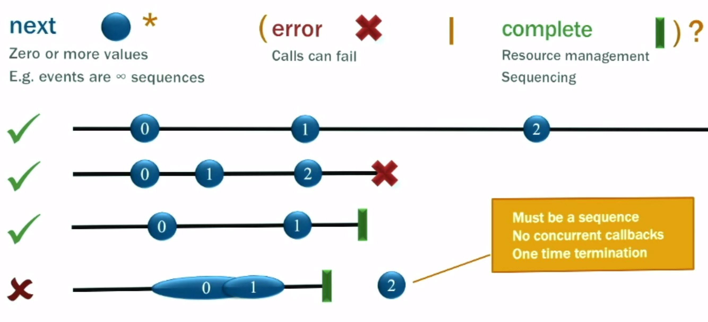

Order: 5
---

Hay muchas malas explicaciones y definiciones en internet. Vamos a poner negro sobre blanco.

_Programación Reactiva es la programación con streams de datos asíncronos._

En cierto modo, esto no es nada nuevo. Los buses de eventos o tu típico evento de click son realmente un stream de eventos asíncronos, lo cual puedes observar y hacer algo con ello. La programación reactiva es la misma idea con esteroides. Tienes la posibilidad de crear un stream de datos de cualguier cosa, no sólo desde el evento click o hover.

Streams son baratos y ubícuos y caulquier cosa puede utilizase como un stream. variable, entradas de usuarios, propiedades, cachés, estructuras de datos, etc. Por ejemplo, imagina Twitter, podría ser un stream de datos del mismo modo los eventos de click. Puedes escucharlo como un stream y reaccionar de modo acorde.

Arriba del todo, estas cogiendo una fantástica herramienta para combinar funciones, crear y filtrar cualquier stream. Aquí es donde entra en juego la magia "funcional". Un stream puede ser utilizado como entrada para otro. Incluso múltiples streams pueden ser utilizados como entradas para otro stream. Puedes mezclar dos stream. Puedes filtrar un stream para coger otro que sólo tiene los eventos en los que estás interesados. Puedes seleccionar los valores desde un stream para generar uno nuevo.

Si los streams son el centro de Reactive, ten cuidad al observarlos, comienza con nuestro familiar "clicks en un botón" como stream de evento.

Un stream es una sequencia de _eventos en curso ordenados a tiempo_. Se pueden emitir tres señales diferentes: un valor(de algún tipo), un error, o un "completado". Considera que recibes "completado" para una instancia cuando la ventana actual o la vista que contiene el botón está cerrada.

Capturamos los eventos emitidos sólo _asíncronamente_, por definición, una función que se ejecutará cuando un valor es emitido, otra función cuando un error es emitido y otra función cuando 'completado' es emitido. A veces estos dos últimos pueden ser emitidos y puedes enfocarte en definir la función para los valores. Escuchar los streams es llamado subscripción. Las funciones que estamos definiendo son observadores. El stream es el sujeto (o "observable") siendo observado. Esto es precisamente el [Observer Design Pattern](https://en.wikipedia.org/wiki/Observer_pattern).

La parte más dura de aprender es _pensar en Reacitive_. Se trata de dejar de lado los viejos hábitos imperativos y con estado de la programación típica, y forzar a tu cerebro a trabajar en un paradigma diferente.